# Backend endpoint sequence diagrams

These diagrams cover the 18 FastEndpoints registered under `src/WebApi/Features`. Route paths include their group prefix. `Client` represents a browser, device, or API consumer. `API pipeline` represents ASP.NET Core routing, authentication/authorization, FastEndpoints binding/validation, and the endpoint response. Authenticated routes are stopped by the policy middleware when the request lacks the required JWT policy. Database calls are shown against SQL Server via EF Core. Diagrams follow the endpoint and service implementations; they omit unrelated hosting and telemetry details.

## Authentication (`/auth`)

### `POST /auth/login` — password login

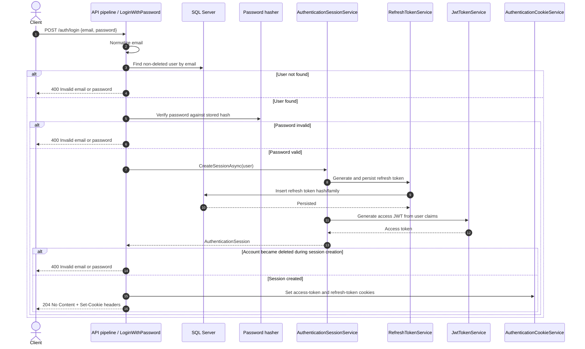
```mermaid
sequenceDiagram
    autonumber
    actor Client
    participant API as API pipeline / LoginWithPassword
    participant DB as SQL Server
    participant Hasher as Password hasher
    participant Sessions as AuthenticationSessionService
    participant Refresh as RefreshTokenService
    participant JWT as JwtTokenService
    participant Cookies as AuthenticationCookieService
    Client->>API: POST /auth/login {email, password}
    API->>API: Normalize email
    API->>DB: Find non-deleted user by email
    alt User not found
        API-->>Client: 400 Invalid email or password
    else User found
        API->>Hasher: Verify password against stored hash
        alt Password invalid
            API-->>Client: 400 Invalid email or password
        else Password valid
            API->>Sessions: CreateSessionAsync(user)
            Sessions->>Refresh: Generate and persist refresh token
            Refresh->>DB: Insert refresh token hash/family
            DB-->>Refresh: Persisted
            Sessions->>JWT: Generate access JWT from user claims
            JWT-->>Sessions: Access token
            Sessions-->>API: AuthenticationSession
            alt Account became deleted during session creation
                API-->>Client: 400 Invalid email or password
            else Session created
                API->>Cookies: Set access-token and refresh-token cookies
                API-->>Client: 204 No Content + Set-Cookie headers
            end
        end
    end
```

### `POST /auth/login/access-code` — administrative access-code login

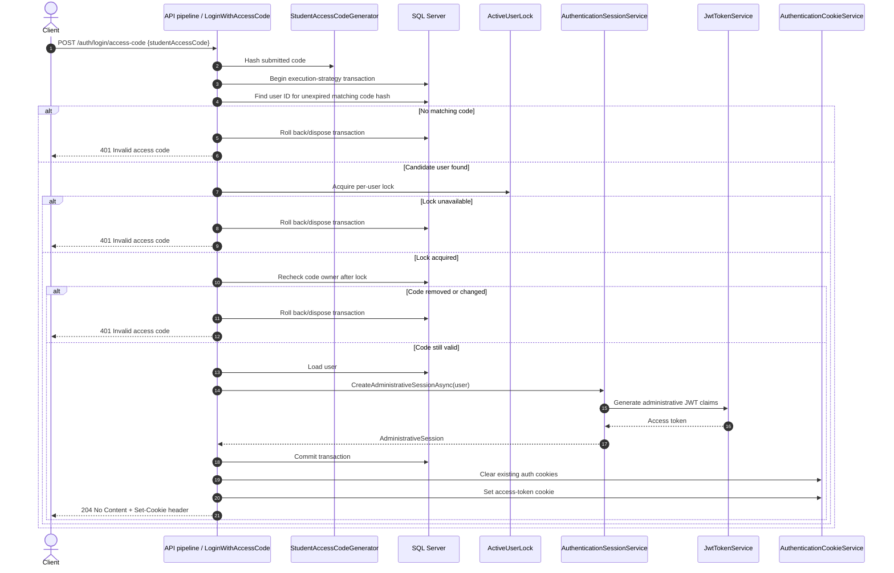
```mermaid
sequenceDiagram
    autonumber
    actor Client
    participant API as API pipeline / LoginWithAccessCode
    participant Code as StudentAccessCodeGenerator
    participant DB as SQL Server
    participant Lock as ActiveUserLock
    participant Sessions as AuthenticationSessionService
    participant JWT as JwtTokenService
    participant Cookies as AuthenticationCookieService
    Client->>API: POST /auth/login/access-code {studentAccessCode}
    API->>Code: Hash submitted code
    API->>DB: Begin execution-strategy transaction
    API->>DB: Find user ID for unexpired matching code hash
    alt No matching code
        API->>DB: Roll back/dispose transaction
        API-->>Client: 401 Invalid access code
    else Candidate user found
        API->>Lock: Acquire per-user lock
        alt Lock unavailable
            API->>DB: Roll back/dispose transaction
            API-->>Client: 401 Invalid access code
        else Lock acquired
            API->>DB: Recheck code owner after lock
            alt Code removed or changed
                API->>DB: Roll back/dispose transaction
                API-->>Client: 401 Invalid access code
            else Code still valid
                API->>DB: Load user
                API->>Sessions: CreateAdministrativeSessionAsync(user)
                Sessions->>JWT: Generate administrative JWT claims
                JWT-->>Sessions: Access token
                Sessions-->>API: AdministrativeSession
                API->>DB: Commit transaction
                API->>Cookies: Clear existing auth cookies
                API->>Cookies: Set access-token cookie
                API-->>Client: 204 No Content + Set-Cookie header
            end
        end
    end
```

### `POST /auth/register` — student registration

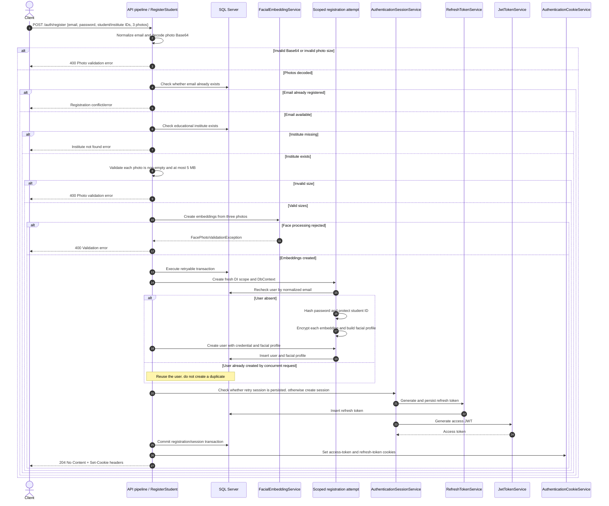
```mermaid
sequenceDiagram
    autonumber
    actor Client
    participant API as API pipeline / RegisterStudent
    participant DB as SQL Server
    participant Face as FacialEmbeddingService
    participant Scope as Scoped registration attempt
    participant Sessions as AuthenticationSessionService
    participant Refresh as RefreshTokenService
    participant JWT as JwtTokenService
    participant Cookies as AuthenticationCookieService
    Client->>API: POST /auth/register {email, password, student/institute IDs, 3 photos}
    API->>API: Normalize email and decode photo Base64
    alt Invalid Base64 or invalid photo size
        API-->>Client: 400 Photo validation error
    else Photos decoded
        API->>DB: Check whether email already exists
        alt Email already registered
            API-->>Client: Registration conflict/error
        else Email available
            API->>DB: Check educational institute exists
            alt Institute missing
                API-->>Client: Institute not found error
            else Institute exists
                API->>API: Validate each photo is non-empty and at most 5 MB
                alt Invalid size
                    API-->>Client: 400 Photo validation error
                else Valid sizes
                    API->>Face: Create embeddings from three photos
                    alt Face processing rejected
                        Face-->>API: FacePhotoValidationException
                        API-->>Client: 400 Validation error
                    else Embeddings created
                        API->>DB: Execute retryable transaction
                        API->>Scope: Create fresh DI scope and DbContext
                        Scope->>DB: Recheck user by normalized email
                        alt User absent
                            Scope->>Scope: Hash password and protect student ID
                            Scope->>Scope: Encrypt each embedding and build facial profile
                            API->>Scope: Create user with credential and facial profile
                            Scope->>DB: Insert user and facial profile
                        else User already created by concurrent request
                            Note over API,DB: Reuse the user. do not create a duplicate
                        end
                        API->>Sessions: Check whether retry session is persisted. otherwise create session
                        Sessions->>Refresh: Generate and persist refresh token
                        Refresh->>DB: Insert refresh token
                        Sessions->>JWT: Generate access JWT
                        JWT-->>Sessions: Access token
                        API->>DB: Commit registration/session transaction
                        API->>Cookies: Set access-token and refresh-token cookies
                        API-->>Client: 204 No Content + Set-Cookie headers
                    end
                end
            end
        end
    end
```

### `GET /auth/me` — current authenticated user

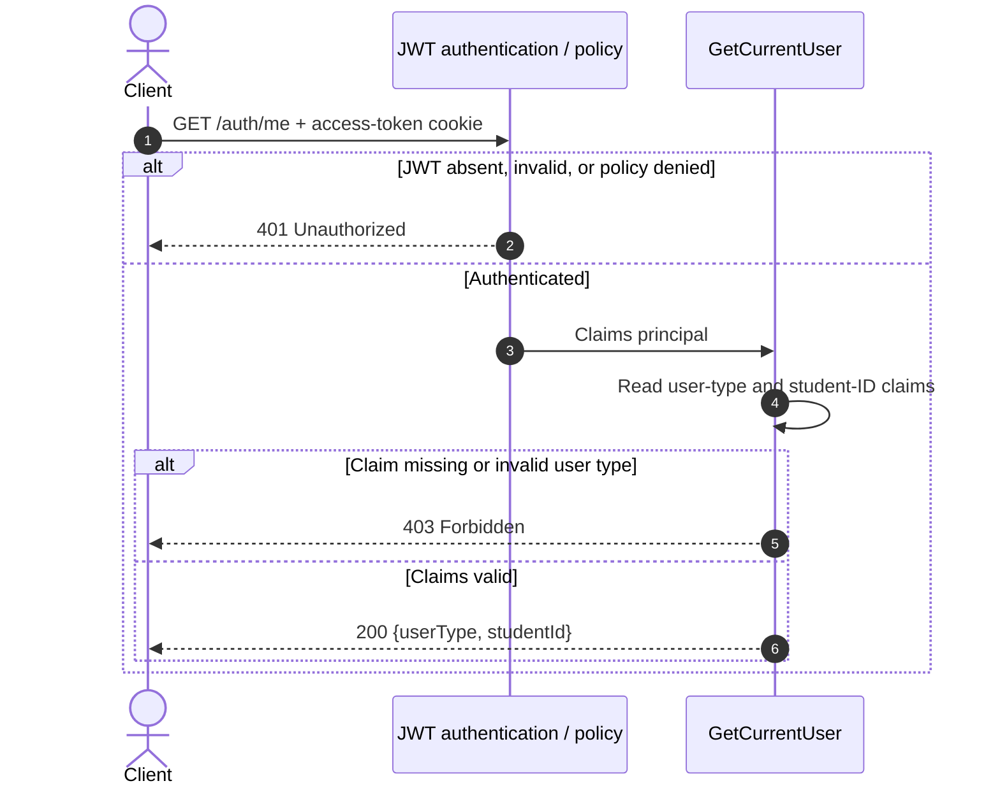
```mermaid
sequenceDiagram
    autonumber
    actor Client
    participant Auth as JWT authentication / policy
    participant API as GetCurrentUser
    Client->>Auth: GET /auth/me + access-token cookie
    alt JWT absent, invalid, or policy denied
        Auth-->>Client: 401 Unauthorized
    else Authenticated
        Auth->>API: Claims principal
        API->>API: Read user-type and student-ID claims
        alt Claim missing or invalid user type
            API-->>Client: 403 Forbidden
        else Claims valid
            API-->>Client: 200 {userType, studentId}
        end
    end
```

### `POST /auth/refresh` — rotate refresh token

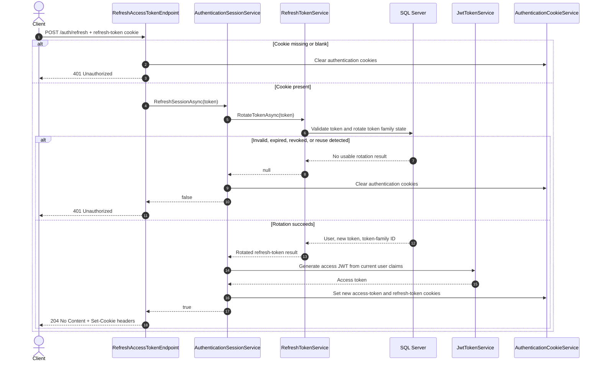
```mermaid
sequenceDiagram
    autonumber
    actor Client
    participant API as RefreshAccessTokenEndpoint
    participant Sessions as AuthenticationSessionService
    participant Refresh as RefreshTokenService
    participant DB as SQL Server
    participant JWT as JwtTokenService
    participant Cookies as AuthenticationCookieService
    Client->>API: POST /auth/refresh + refresh-token cookie
    alt Cookie missing or blank
        API->>Cookies: Clear authentication cookies
        API-->>Client: 401 Unauthorized
    else Cookie present
        API->>Sessions: RefreshSessionAsync(token)
        Sessions->>Refresh: RotateTokenAsync(token)
        Refresh->>DB: Validate token and rotate token family state
        alt Invalid, expired, revoked, or reuse detected
            DB-->>Refresh: No usable rotation result
            Refresh-->>Sessions: null
            Sessions->>Cookies: Clear authentication cookies
            Sessions-->>API: false
            API-->>Client: 401 Unauthorized
        else Rotation succeeds
            DB-->>Refresh: User, new token, token-family ID
            Refresh-->>Sessions: Rotated refresh-token result
            Sessions->>JWT: Generate access JWT from current user claims
            JWT-->>Sessions: Access token
            Sessions->>Cookies: Set new access-token and refresh-token cookies
            Sessions-->>API: true
            API-->>Client: 204 No Content + Set-Cookie headers
        end
    end
```

### `POST /auth/logout` — revoke session

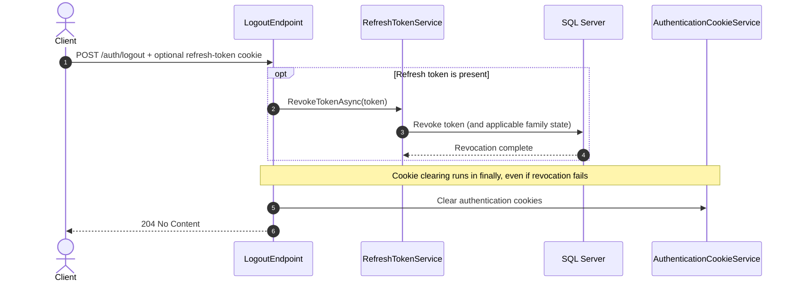
```mermaid
sequenceDiagram
    autonumber
    actor Client
    participant API as LogoutEndpoint
    participant Refresh as RefreshTokenService
    participant DB as SQL Server
    participant Cookies as AuthenticationCookieService
    Client->>API: POST /auth/logout + optional refresh-token cookie
    opt Refresh token is present
        API->>Refresh: RevokeTokenAsync(token)
        Refresh->>DB: Revoke token (and applicable family state)
        DB-->>Refresh: Revocation complete
    end
    Note over API,Cookies: Cookie clearing runs in finally, even if revocation fails
    API->>Cookies: Clear authentication cookies
    API-->>Client: 204 No Content
```

### `POST /auth/password-reset/request` — request reset email

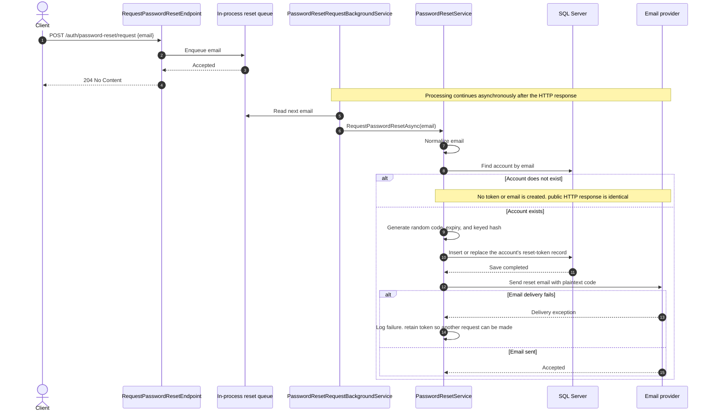
```mermaid
sequenceDiagram
    autonumber
    actor Client
    participant API as RequestPasswordResetEndpoint
    participant Queue as In-process reset queue
    participant Worker as PasswordResetRequestBackgroundService
    participant Service as PasswordResetService
    participant DB as SQL Server
    participant Email as Email provider
    Client->>API: POST /auth/password-reset/request {email}
    API->>Queue: Enqueue email
    Queue-->>API: Accepted
    API-->>Client: 204 No Content
    Note over Worker,Email: Processing continues asynchronously after the HTTP response
    Worker->>Queue: Read next email
    Worker->>Service: RequestPasswordResetAsync(email)
    Service->>Service: Normalize email
    Service->>DB: Find account by email
    alt Account does not exist
        Note over Service,Email: No token or email is created. public HTTP response is identical
    else Account exists
        Service->>Service: Generate random code, expiry, and keyed hash
        Service->>DB: Insert or replace the account's reset-token record
        DB-->>Service: Save completed
        Service->>Email: Send reset email with plaintext code
        alt Email delivery fails
            Email-->>Service: Delivery exception
            Service->>Service: Log failure. retain token so another request can be made
        else Email sent
            Email-->>Service: Accepted
        end
    end
```

### `POST /auth/password-reset/verify` — verify reset code

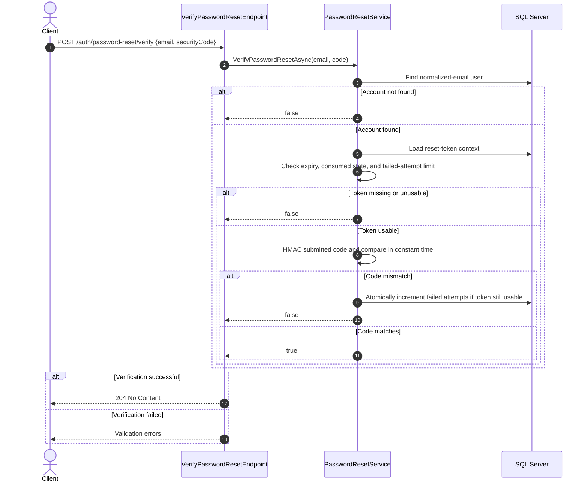
```mermaid
sequenceDiagram
    autonumber
    actor Client
    participant API as VerifyPasswordResetEndpoint
    participant Service as PasswordResetService
    participant DB as SQL Server
    Client->>API: POST /auth/password-reset/verify {email, securityCode}
    API->>Service: VerifyPasswordResetAsync(email, code)
    Service->>DB: Find normalized-email user
    alt Account not found
        Service-->>API: false
    else Account found
        Service->>DB: Load reset-token context
        Service->>Service: Check expiry, consumed state, and failed-attempt limit
        alt Token missing or unusable
            Service-->>API: false
        else Token usable
            Service->>Service: HMAC submitted code and compare in constant time
            alt Code mismatch
                Service->>DB: Atomically increment failed attempts if token still usable
                Service-->>API: false
            else Code matches
                Service-->>API: true
            end
        end
    end
    alt Verification successful
        API-->>Client: 204 No Content
    else Verification failed
        API-->>Client: Validation errors
    end
```

### `POST /auth/password-reset/complete` — change password with reset code

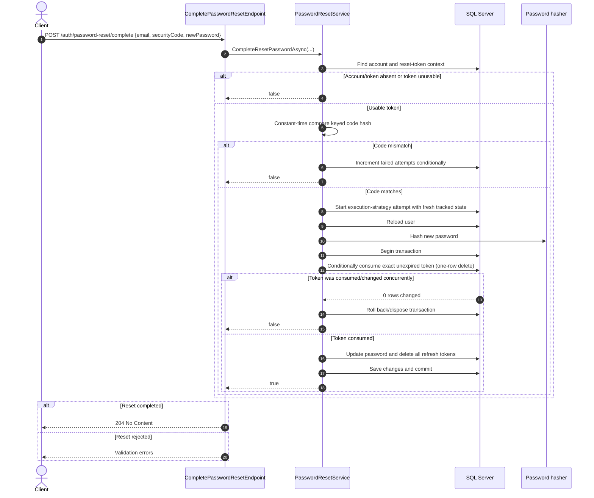
```mermaid
sequenceDiagram
    autonumber
    actor Client
    participant API as CompletePasswordResetEndpoint
    participant Service as PasswordResetService
    participant DB as SQL Server
    participant Hasher as Password hasher
    Client->>API: POST /auth/password-reset/complete {email, securityCode, newPassword}
    API->>Service: CompleteResetPasswordAsync(...)
    Service->>DB: Find account and reset-token context
    alt Account/token absent or token unusable
        Service-->>API: false
    else Usable token
        Service->>Service: Constant-time compare keyed code hash
        alt Code mismatch
            Service->>DB: Increment failed attempts conditionally
            Service-->>API: false
        else Code matches
            Service->>DB: Start execution-strategy attempt with fresh tracked state
            Service->>DB: Reload user
            Service->>Hasher: Hash new password
            Service->>DB: Begin transaction
            Service->>DB: Conditionally consume exact unexpired token (one-row delete)
            alt Token was consumed/changed concurrently
                DB-->>Service: 0 rows changed
                Service->>DB: Roll back/dispose transaction
                Service-->>API: false
            else Token consumed
                Service->>DB: Update password and delete all refresh tokens
                Service->>DB: Save changes and commit
                Service-->>API: true
            end
        end
    end
    alt Reset completed
        API-->>Client: 204 No Content
    else Reset rejected
        API-->>Client: Validation errors
    end
```

## Attendance (`/attendance`)

### `POST /attendance` — record a face-recognized arrival

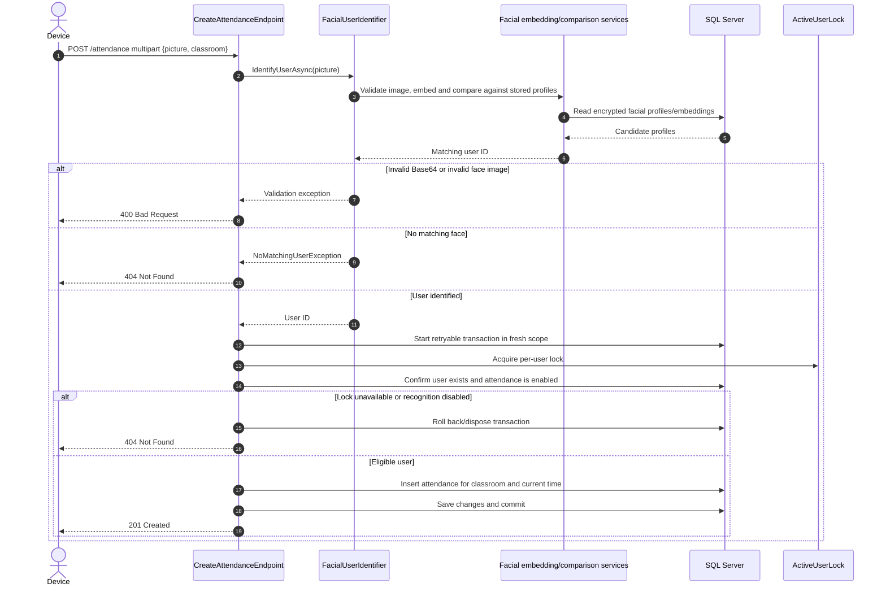
```mermaid
sequenceDiagram
    autonumber
    actor Device
    participant API as CreateAttendanceEndpoint
    participant Identify as FacialUserIdentifier
    participant Face as Facial embedding/comparison services
    participant DB as SQL Server
    participant Lock as ActiveUserLock
    Device->>API: POST /attendance multipart {picture, classroom}
    API->>Identify: IdentifyUserAsync(picture)
    Identify->>Face: Validate image, embed and compare against stored profiles
    Face->>DB: Read encrypted facial profiles/embeddings
    DB-->>Face: Candidate profiles
    Face-->>Identify: Matching user ID
    alt Invalid Base64 or invalid face image
        Identify-->>API: Validation exception
        API-->>Device: 400 Bad Request
    else No matching face
        Identify-->>API: NoMatchingUserException
        API-->>Device: 404 Not Found
    else User identified
        Identify-->>API: User ID
        API->>DB: Start retryable transaction in fresh scope
        API->>Lock: Acquire per-user lock
        API->>DB: Confirm user exists and attendance is enabled
        alt Lock unavailable or recognition disabled
            API->>DB: Roll back/dispose transaction
            API-->>Device: 404 Not Found
        else Eligible user
            API->>DB: Insert attendance for classroom and current time
            API->>DB: Save changes and commit
            API-->>Device: 201 Created
        end
    end
```

### `GET /attendance` — paged attendance history

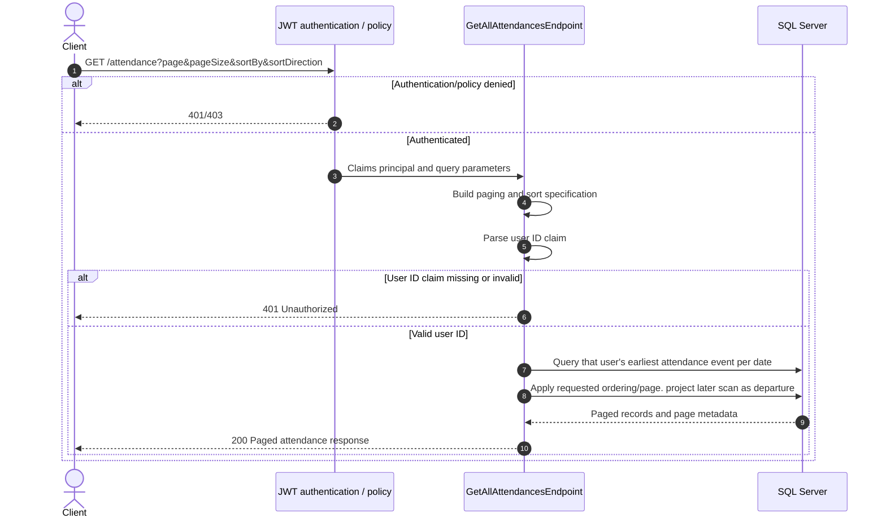
```mermaid
sequenceDiagram
    autonumber
    actor Client
    participant Auth as JWT authentication / policy
    participant API as GetAllAttendancesEndpoint
    participant DB as SQL Server
    Client->>Auth: GET /attendance?page&pageSize&sortBy&sortDirection
    alt Authentication/policy denied
        Auth-->>Client: 401/403
    else Authenticated
        Auth->>API: Claims principal and query parameters
        API->>API: Build paging and sort specification
        API->>API: Parse user ID claim
        alt User ID claim missing or invalid
            API-->>Client: 401 Unauthorized
        else Valid user ID
            API->>DB: Query that user's earliest attendance event per date
            API->>DB: Apply requested ordering/page. project later scan as departure
            DB-->>API: Paged records and page metadata
            API-->>Client: 200 Paged attendance response
        end
    end
```

## Educational institutes (`/educational-institutes`)

### `GET /educational-institutes` — list institutes

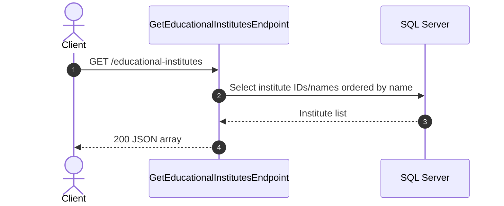
```mermaid
sequenceDiagram
    autonumber
    actor Client
    participant API as GetEducationalInstitutesEndpoint
    participant DB as SQL Server
    Client->>API: GET /educational-institutes
    API->>DB: Select institute IDs/names ordered by name
    DB-->>API: Institute list
    API-->>Client: 200 JSON array
```

## Settings (`/settings`)

### `GET /settings/attendance-preference` — read recognition preference

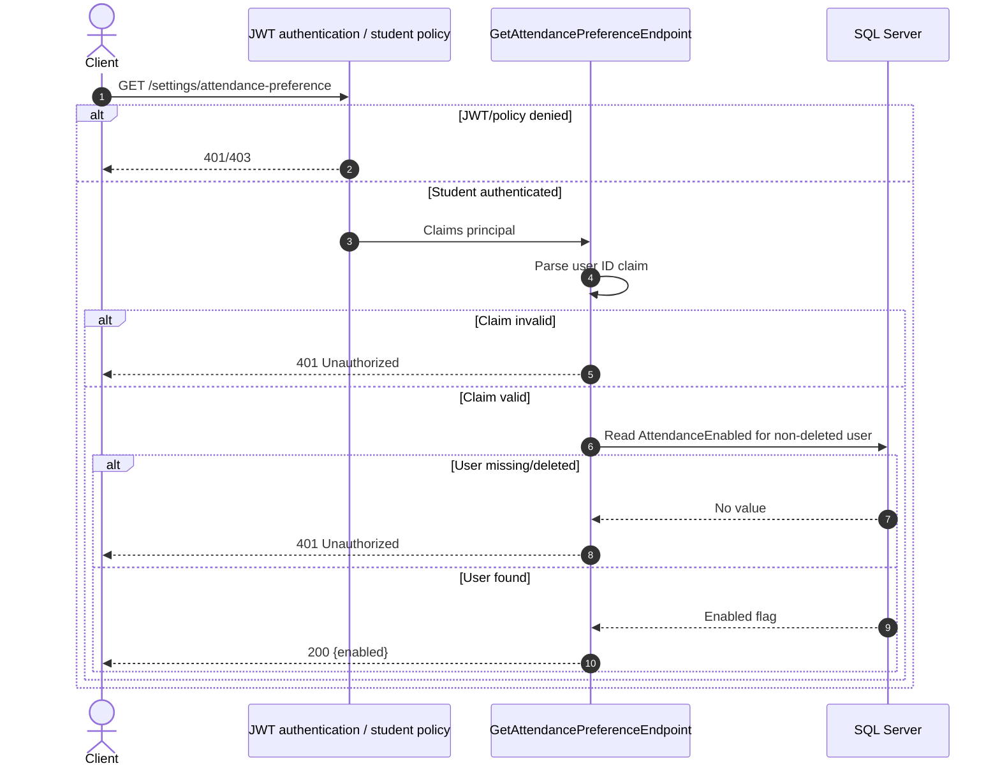
```mermaid
sequenceDiagram
    autonumber
    actor Client
    participant Auth as JWT authentication / student policy
    participant API as GetAttendancePreferenceEndpoint
    participant DB as SQL Server
    Client->>Auth: GET /settings/attendance-preference
    alt JWT/policy denied
        Auth-->>Client: 401/403
    else Student authenticated
        Auth->>API: Claims principal
        API->>API: Parse user ID claim
        alt Claim invalid
            API-->>Client: 401 Unauthorized
        else Claim valid
            API->>DB: Read AttendanceEnabled for non-deleted user
            alt User missing/deleted
                DB-->>API: No value
                API-->>Client: 401 Unauthorized
            else User found
                DB-->>API: Enabled flag
                API-->>Client: 200 {enabled}
            end
        end
    end
```

### `PATCH /settings/attendance-preference` — enable/disable recognition

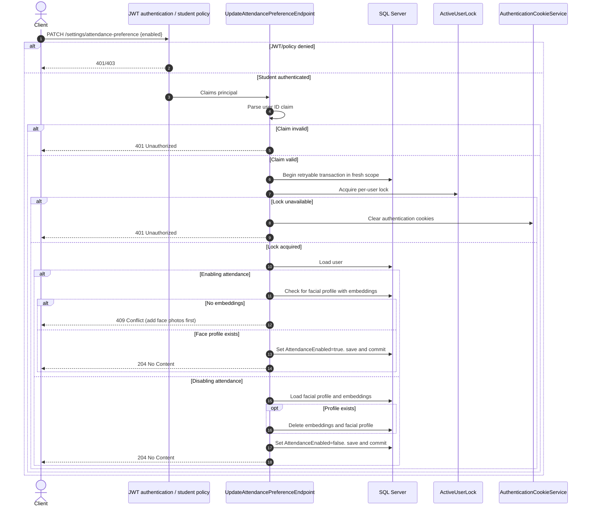
```mermaid
sequenceDiagram
    autonumber
    actor Client
    participant Auth as JWT authentication / student policy
    participant API as UpdateAttendancePreferenceEndpoint
    participant DB as SQL Server
    participant Lock as ActiveUserLock
    participant Cookies as AuthenticationCookieService
    Client->>Auth: PATCH /settings/attendance-preference {enabled}
    alt JWT/policy denied
        Auth-->>Client: 401/403
    else Student authenticated
        Auth->>API: Claims principal
        API->>API: Parse user ID claim
        alt Claim invalid
            API-->>Client: 401 Unauthorized
        else Claim valid
            API->>DB: Begin retryable transaction in fresh scope
            API->>Lock: Acquire per-user lock
            alt Lock unavailable
                API->>Cookies: Clear authentication cookies
                API-->>Client: 401 Unauthorized
            else Lock acquired
                API->>DB: Load user
                alt Enabling attendance
                    API->>DB: Check for facial profile with embeddings
                    alt No embeddings
                        API-->>Client: 409 Conflict (add face photos first)
                    else Face profile exists
                        API->>DB: Set AttendanceEnabled=true. save and commit
                        API-->>Client: 204 No Content
                    end
                else Disabling attendance
                    API->>DB: Load facial profile and embeddings
                    opt Profile exists
                        API->>DB: Delete embeddings and facial profile
                    end
                    API->>DB: Set AttendanceEnabled=false. save and commit
                    API-->>Client: 204 No Content
                end
            end
        end
    end
```

### `PATCH /settings/face-photos` — replace registered face photos

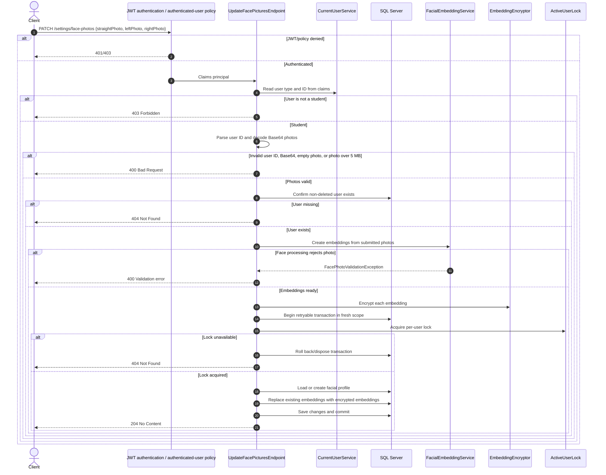
```mermaid
sequenceDiagram
    autonumber
    actor Client
    participant Auth as JWT authentication / authenticated-user policy
    participant API as UpdateFacePicturesEndpoint
    participant Current as CurrentUserService
    participant DB as SQL Server
    participant Face as FacialEmbeddingService
    participant Encrypt as EmbeddingEncryptor
    participant Lock as ActiveUserLock
    Client->>Auth: PATCH /settings/face-photos {straightPhoto, leftPhoto, rightPhoto}
    alt JWT/policy denied
        Auth-->>Client: 401/403
    else Authenticated
        Auth->>API: Claims principal
        API->>Current: Read user type and ID from claims
        alt User is not a student
            API-->>Client: 403 Forbidden
        else Student
            API->>API: Parse user ID and decode Base64 photos
            alt Invalid user ID, Base64, empty photo, or photo over 5 MB
                API-->>Client: 400 Bad Request
            else Photos valid
                API->>DB: Confirm non-deleted user exists
                alt User missing
                    API-->>Client: 404 Not Found
                else User exists
                    API->>Face: Create embeddings from submitted photos
                    alt Face processing rejects photo
                        Face-->>API: FacePhotoValidationException
                        API-->>Client: 400 Validation error
                    else Embeddings ready
                        API->>Encrypt: Encrypt each embedding
                        API->>DB: Begin retryable transaction in fresh scope
                        API->>Lock: Acquire per-user lock
                        alt Lock unavailable
                            API->>DB: Roll back/dispose transaction
                            API-->>Client: 404 Not Found
                        else Lock acquired
                            API->>DB: Load or create facial profile
                            API->>DB: Replace existing embeddings with encrypted embeddings
                            API->>DB: Save changes and commit
                            API-->>Client: 204 No Content
                        end
                    end
                end
            end
        end
    end
```

### `GET /settings/student-access-code` — get or generate today's code

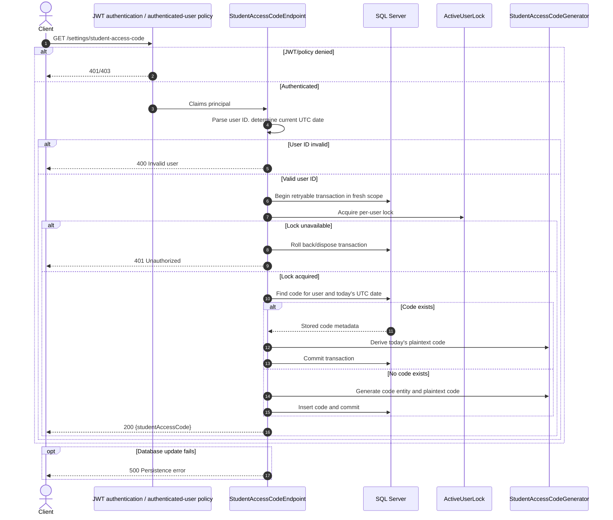
```mermaid
sequenceDiagram
    autonumber
    actor Client
    participant Auth as JWT authentication / authenticated-user policy
    participant API as StudentAccessCodeEndpoint
    participant DB as SQL Server
    participant Lock as ActiveUserLock
    participant Codes as StudentAccessCodeGenerator
    Client->>Auth: GET /settings/student-access-code
    alt JWT/policy denied
        Auth-->>Client: 401/403
    else Authenticated
        Auth->>API: Claims principal
        API->>API: Parse user ID. determine current UTC date
        alt User ID invalid
            API-->>Client: 400 Invalid user
        else Valid user ID
            API->>DB: Begin retryable transaction in fresh scope
            API->>Lock: Acquire per-user lock
            alt Lock unavailable
                API->>DB: Roll back/dispose transaction
                API-->>Client: 401 Unauthorized
            else Lock acquired
                API->>DB: Find code for user and today's UTC date
                alt Code exists
                    DB-->>API: Stored code metadata
                    API->>Codes: Derive today's plaintext code
                    API->>DB: Commit transaction
                else No code exists
                    API->>Codes: Generate code entity and plaintext code
                    API->>DB: Insert code and commit
                end
                API-->>Client: 200 {studentAccessCode}
            end
        end
    end
    opt Database update fails
        API-->>Client: 500 Persistence error
    end
```

### `DELETE /settings/account` — delete account and personal data

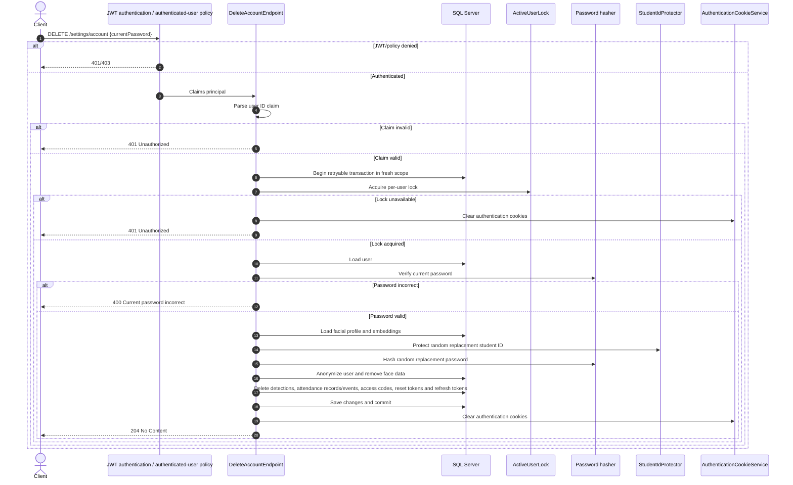
```mermaid
sequenceDiagram
    autonumber
    actor Client
    participant Auth as JWT authentication / authenticated-user policy
    participant API as DeleteAccountEndpoint
    participant DB as SQL Server
    participant Lock as ActiveUserLock
    participant Hasher as Password hasher
    participant Protector as StudentIdProtector
    participant Cookies as AuthenticationCookieService
    Client->>Auth: DELETE /settings/account {currentPassword}
    alt JWT/policy denied
        Auth-->>Client: 401/403
    else Authenticated
        Auth->>API: Claims principal
        API->>API: Parse user ID claim
        alt Claim invalid
            API-->>Client: 401 Unauthorized
        else Claim valid
            API->>DB: Begin retryable transaction in fresh scope
            API->>Lock: Acquire per-user lock
            alt Lock unavailable
                API->>Cookies: Clear authentication cookies
                API-->>Client: 401 Unauthorized
            else Lock acquired
                API->>DB: Load user
                API->>Hasher: Verify current password
                alt Password incorrect
                    API-->>Client: 400 Current password incorrect
                else Password valid
                    API->>DB: Load facial profile and embeddings
                    API->>Protector: Protect random replacement student ID
                    API->>Hasher: Hash random replacement password
                    API->>DB: Anonymize user and remove face data
                    API->>DB: Delete detections, attendance records/events, access codes, reset tokens and refresh tokens
                    API->>DB: Save changes and commit
                    API->>Cookies: Clear authentication cookies
                    API-->>Client: 204 No Content
                end
            end
        end
    end
```

### `GET /settings/personal-data` — export personal data

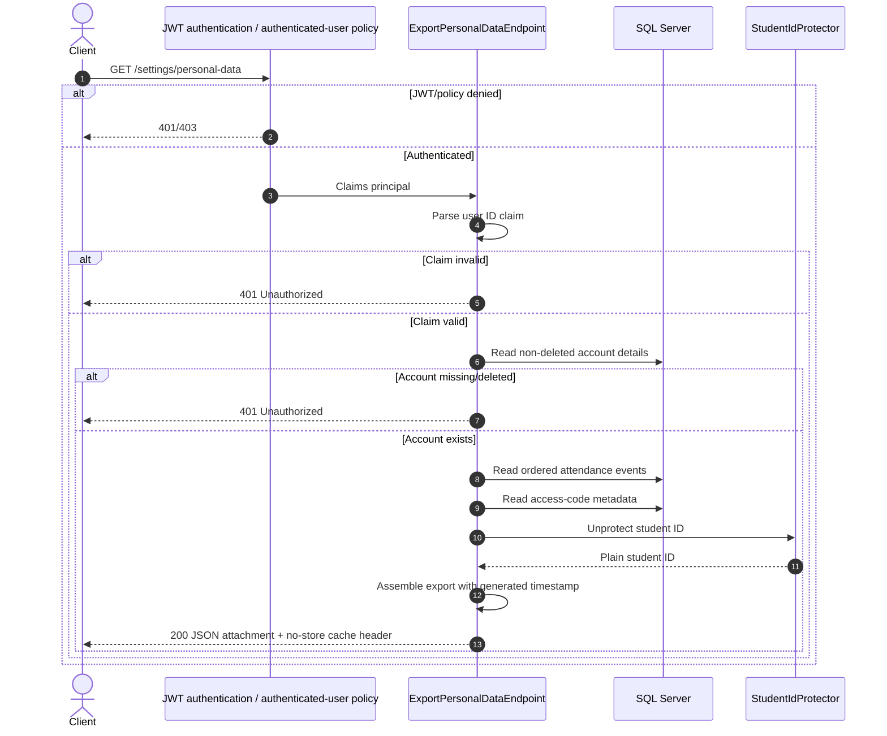
```mermaid
sequenceDiagram
    autonumber
    actor Client
    participant Auth as JWT authentication / authenticated-user policy
    participant API as ExportPersonalDataEndpoint
    participant DB as SQL Server
    participant Protector as StudentIdProtector
    Client->>Auth: GET /settings/personal-data
    alt JWT/policy denied
        Auth-->>Client: 401/403
    else Authenticated
        Auth->>API: Claims principal
        API->>API: Parse user ID claim
        alt Claim invalid
            API-->>Client: 401 Unauthorized
        else Claim valid
            API->>DB: Read non-deleted account details
            alt Account missing/deleted
                API-->>Client: 401 Unauthorized
            else Account exists
                API->>DB: Read ordered attendance events
                API->>DB: Read access-code metadata
                API->>Protector: Unprotect student ID
                Protector-->>API: Plain student ID
                API->>API: Assemble export with generated timestamp
                API-->>Client: 200 JSON attachment + no-store cache header
            end
        end
    end
```
