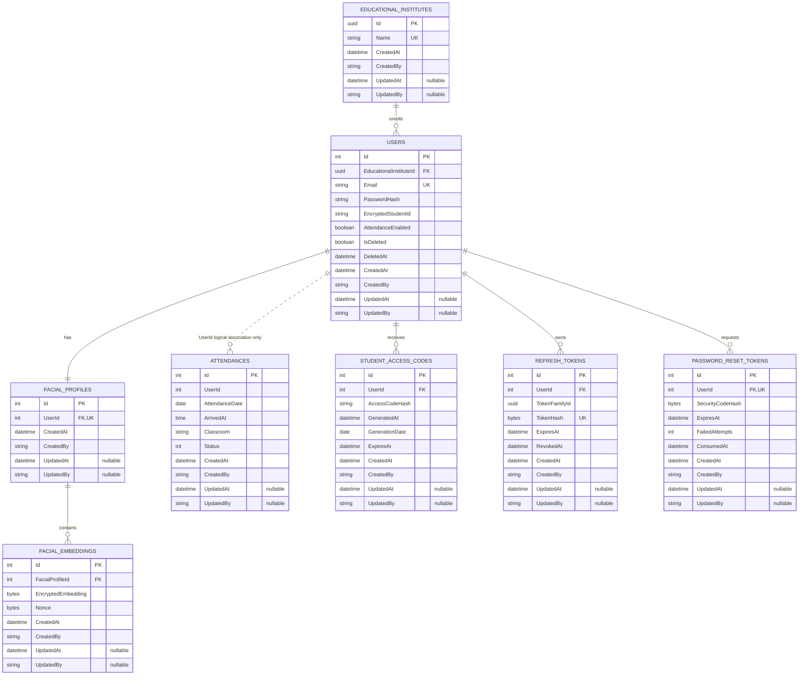

# Backend entity relationship diagram

This diagram reflects the EF Core model snapshot and configurations in `src/WebApi/Common/Persistence`. The database is PostgreSQL. Primary keys, foreign keys, and uniquely indexed columns are marked. Every table inherits `CreatedAt`, `CreatedBy`, `UpdatedAt`, and `UpdatedBy` from the shared `Auditable` base class; these columns are listed on each table because they are present in every table in the database.

`FacialProfiles.UserId` is unique, so each profile belongs to exactly one user and each user has at most one profile. The model marks the relationship required; application registration creates a profile for the user. `PasswordResetTokens.UserId` is also unique, allowing at most one reset token per user. Student access codes have a unique composite index on `(UserId, GenerationDate)`, and refresh-token hashes are unique.

`Attendances.UserId` is stored as an integer but the EF model does not configure it as a foreign key to `Users`; its association is logical and is drawn with a dotted edge. `ActiveUserLock` is an update lock on the user row inside a transaction, not a separate table. The former `AttendanceRecords` and `AttendanceDetections` tables are removed from the model; the forward migration drops them.
